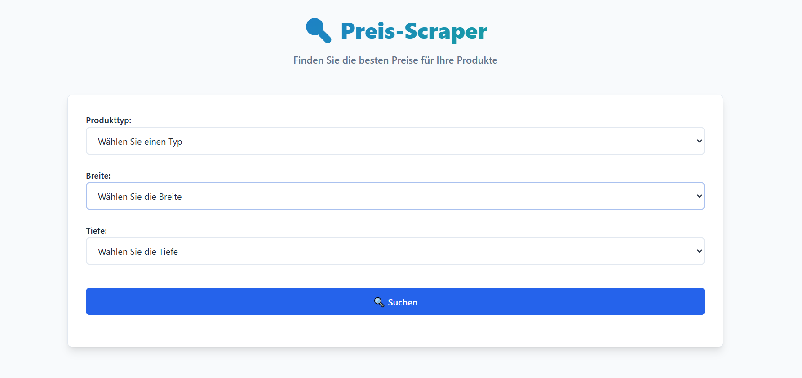

# 🔍 Preis-Scraper Frontend

A modern React frontend application for searching and comparing product prices. This application provides an intuitive interface for users to search for specific products by specifying dimensions and displays the results with comprehensive pricing information and modern UI/UX.

## ✨ Features

- **Modern UI/UX** - Clean, responsive design with smooth animations
- **Product Search** - Search by type, width, and depth with form validation
- **Real-time Price Comparison** - Live price data from backend API
- **Average Price Calculation** - Automatic calculation and display of average prices
- **German Interface** - Fully localized German user interface
- **Responsive Design** - Optimized for desktop, tablet, and mobile devices
- **Dark Mode Support** - Automatic dark/light theme based on system preferences
- **Loading States** - User-friendly loading indicators and error handling
- **Form Validation** - Client-side validation with clear error messages
- **Modern Card Layout** - Beautiful product cards with hover effects and call-to-action buttons

## 📸 Screenshot


*Modern React frontend interface showing product search form and results with responsive design*

## 🛍️ Supported Products

- **Waschbecken** (Wash Basins)
- **Heizkörper** (Radiators)  
- **Spüle** (Sinks)
- **Badewanne** (Bathtubs)

## Getting Started

### Prerequisites

- Node.js (version 16 or higher)
- npm, yarn, pnpm, or bun
- Backend API running on `http://localhost:5000`

### Installation

1. Clone the repository:
```bash
git clone <repository-url>
cd PriceScraperFrontend
```

2. Install dependencies:
```bash
npm install
# or
yarn install
# or
pnpm install
```

3. Start the development server:
```bash
npm run dev
# or
yarn dev
# or
pnpm dev
# or
bun dev
```

4. Open [http://localhost:5173](http://localhost:5173) in your browser

## 🚀 Usage

1. **Select Product Type** - Choose from Waschbecken, Heizkörper, Spüle, or Badewanne
2. **Choose Dimensions** - Select width (50cm, 60cm, 80cm, 100cm, 120cm) and depth (30cm, 40cm, 50cm, 60cm)
3. **Search Products** - Click "🔍 Suchen" to find matching products
4. **View Results** - Browse through product cards with prices, links, and average pricing
5. **Access Products** - Click "Produkt ansehen" to visit the product page

### 🎯 Key Features in Action
- **Form Validation** - All fields must be filled before searching
- **Loading States** - Visual feedback during API calls
- **Error Handling** - Clear error messages for failed requests
- **Responsive Cards** - Product information displayed in modern, interactive cards
- **Price Comparison** - Easy comparison of prices with highlighted average

## API Integration

The application communicates with a backend API at `http://localhost:5000/submit` that expects:
- **Method**: POST
- **Content-Type**: application/json
- **Body**: 
  ```json
  {
    "productType": "string",
    "productWidth": "string", 
    "productDepth": "string"
  }
  ```

## 📁 Project Structure

```
PriceScraperFrontend/
├── src/
│   ├── App.tsx         # Main application component with form handling
│   ├── App.css         # Modern component styles with CSS variables
│   ├── main.tsx        # Application entry point
│   └── index.css       # Global styles and design system
├── public/             # Static assets (minimal, optimized)
├── index.html          # HTML template with German localization
├── package.json        # Dependencies and scripts
├── vite.config.ts      # Vite configuration
├── tsconfig.json       # TypeScript configuration
├── tsconfig.node.json  # Node-specific TypeScript config
└── .eslintrc.cjs       # ESLint configuration
```

## 🛠️ Technologies Used

- **Vite 5.0.8** - Fast build tool and dev server
- **React 18** - Modern UI library with hooks
- **TypeScript 5.2.2** - Type safety and better development experience
- **CSS3** - Modern styling with custom properties and responsive design
- **ESLint** - Code quality and consistency

## Available Scripts

- `npm run dev` - Start development server
- `npm run build` - Build for production
- `npm run preview` - Preview production build
- `npm run lint` - Run ESLint

## 💻 Development

The main application logic is in `src/App.tsx`. The component includes:
- **Form Handling** - Product search with validation and error handling
- **API Communication** - Robust backend integration with loading states
- **Product Rendering** - Modern card-based product display
- **Price Calculation** - Automatic average price computation
- **State Management** - React hooks for form and application state
- **Error Handling** - User-friendly error messages and validation

### 🎨 Design System
- **CSS Custom Properties** - Consistent theming and easy customization
- **Responsive Grid** - Mobile-first responsive design
- **Modern Animations** - Smooth transitions and hover effects
- **Accessibility** - Proper focus states and keyboard navigation

## 🚀 Recent Updates

- ✅ **Modern UI/UX Design** - Complete visual overhaul with modern design principles
- ✅ **Responsive Layout** - Optimized for all device sizes
- ✅ **Enhanced Form Validation** - Better user feedback and error handling
- ✅ **Improved Product Cards** - Modern card design with better information hierarchy
- ✅ **Dark Mode Support** - Automatic theme switching based on system preferences
- ✅ **Code Optimization** - Removed unused files and improved project structure
- ✅ **Better Error Handling** - Clear, actionable error messages
- ✅ **Loading States** - Visual feedback during API operations

## 🤝 Contributing

1. Fork the repository
2. Create a feature branch (`git checkout -b feature/amazing-feature`)
3. Make your changes
4. Test thoroughly on different devices
5. Commit your changes (`git commit -m 'Add amazing feature'`)
6. Push to the branch (`git push origin feature/amazing-feature`)
7. Open a Pull Request

## 📄 License

This project is private and not licensed for public use.